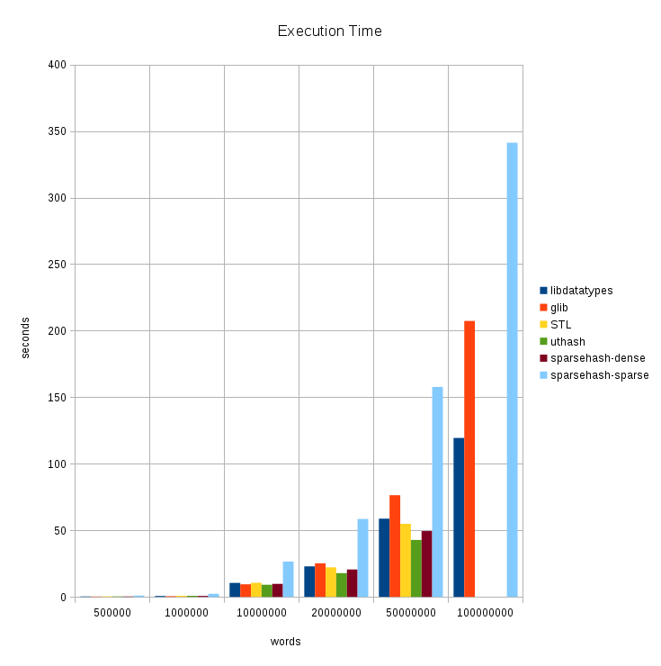

# Hashtable Benchmark

## Introduction

This benchmark compares memory consumption and speed of the following
C/C++ hashtable implementations:

* libdatatypes
* [glib](https://developer.gnome.org/glib/stable)
* [uthash](https://troydhanson.github.io/uthash/)
* [Google sparsehash](https://github.com/sparsehash/sparsehash)
* STL ([std::unordered\_map](http://en.cppreference.com/w/cpp/container/unordered_map))

I did this benchmark for fun. It covers only a single use case, so don't take it too serious.

## Benchmark

The pseudo code below describes the test.

```
start := now()

file := open("words.txt")

while not eof(file):
  word := readword(file)

  if word in table:
    table[word] := table[word] + 1
  else:
    table[word] := 1

close(file)

print(count(table))

sum := 0

for key, value in table:
  sum := sum + value

print(sum)

print(now() - start)
```

I tried to implement each test in an idiomatic way, because I was interested
how the different hash tables perform out of the box. Hence, the performance
depends significantly on the default hash algorithm and growth factor. The
C++ implementations use std::string instead of null-terminated strings as key
type.

All sources were compiled and executed on Slackware 14.2 (64-bit) with the
default C/C++ Compiler (gcc 5.5.0). I have a Dell XPS 15z notebook with
8GB memory and an Intel Core i5-2410M CPU. The system was booted in runlevel
3.

I created 6 text files with random words to count. You find the script
[here](https://github.com/20centaurifux/datatypes/blob/master/benchmark/generator.py).

Each test was executed 10 times. The following data sets provide the median
values of the measured execution times and memory consumptions.

## Results

uthash and sparsehash-dense were terminated during the execution of the last
test. I aborted also the last std::unordered\_map test because my system started
to swap.

### Execution time (seconds)

|words      |libdatatypes|glib      |STL     |uthash   |sparsehash-dense|sparsehash-sparse|
|-----------|------------|----------|--------|---------|----------------|-----------------|
|500.000    |0.354       |0.257     |0.412   |0.372    |0.354           |0.996            |
|1.000.000  |0.670       |0.555     |0.819   |0.826    |0.727           |2.288            |
|10.000.000 |10.489      |9.458     |10.608  |9.113    |9.778           |26.569           |
|20.000.000 |22.923      |25.250    |22.232  |17.876   |20.615          |58.550           |
|50.000.000 |58.799      |76.432    |54.895  |43.785   |49.456          |157.705          |
|100.000.000|119.410     |207.341   | n/a    | n/a     | n/a            |341.185          |



### Memory Consumption (MB)

|words      |libdatatypes |glib         |STL         |uthash      |sparsehash-dense|sparsehash-sparse|
|-----------|-------------|-------------|------------|------------|----------------|-----------------|
|500.000    |36.62        |28.47        |53.86       |69.47       |44.43           |37.70            |
|1.000.000  |63.39        |54.56        |104.67      |150.56      |85.97           |72.10            |
|10.000.000 |689.55       |689.51       |1100.52     |1376.46     |1376.52         |679.01           |
|20.000.000 |1378.40      |1518.71      |2233.22     |2738.18     |2466.31         |1348.80          |
|50.000.000 |3140.36      |3036.45      |5098.67     |6664.82     |4931.72         |3330.66          |
|100.000.000|6241.78      |6072.98      | n/a        | n/a        | n/a            |6613.06          |


## Summary

* uthash and sparsehash-dense are very fast but their memory footprints are high.
* sparsehash-sparse is between 2-3 times slower than other hash tables. It has
  the smallest memory footprint of all C++ implementations in return.
* Speed and memory consumption of libdatatypes and glib are a bit similar,
  but libdatatypes is much faster when large amounts of data are being
  processed.  
* libdatatypes is significantly faster than the other hash tables when storing
  100.000.000 words.
* std::unordered\_map has a good performance but the memory consumption is
  high.

## Other languages

I ran the first four tests with the following additional languages:
* Python 2
* Python 3
* Perl 5
* PHP 5
* .NET Core 2
* Java SDK 1.8, 64-bit
* Clojure 1.8 (with Java SDK 1.8, 64-bit)
* Free Pascal 3.0.2

I want to thank [reinerh](https://github.com/reinerh) for his contribution :)

### Results

#### Execution time (seconds)

|words      |Python2|Python3|Perl5  |PHP5   |.NET Core 2|Java 1.8|Clojure 1.8|Free Pascal   |
|-----------|-------|-------|-------|-------|-----------|--------|-----------|--------------|
|500.000    |0.520  |0.272  |0.574  |0.758  |0.273      |0.757   |3.861      |4.128         |
|1.000.000  |1.119  |0.566  |1.202  |1.548  |0.552      |1.656   |7.597      |7.831         |
|10.000.000 |13.086 |5.959  |16.632 |17.184 |5.941      |26.352  |82.083     |108.807       |
|20.000.000 |27.475 |12.361 |37.534 |39.794 |11.797     |59.737  |184.289    |388.464       |


#### Memory Consumption (MB)

|words      |Python2|Python3|Perl5  |PHP5   |.NET Core 2|Java 1.8|Clojure 1.8|Free Pascal   |
|-----------|-------|-------|-------|-------|-----------|--------|-----------|--------------|
|500.000    |104.24 |82.25  |118.01 |103.13 |92.82      |152.27  |1405.98    |71.57         |
|1.000.000  |197.12 |157.29 |229.98 |177.81 |162.73     |292.93  |2292.41    |124.82        |
|10.000.000 |1828.48|1384.62|2326.57|1548.80|1110.61    |2034.97 |3079.23    |1063.36       |
|20.000.000 |3600.68|2761.82|4639.41|3040.90|2180.49    |3630.35 |4129.21    |1896.86       |


#### Summary

* The overall performance of Python 3 and .NET Core 2 is impressive. They are
  twice as fast as most C/C++ implementations.
* It's remarkable how much more efficient Python 3 is than Python 2.
* Java doesn't make a good impression at all.
* The speed of PHP 5 and Perl 5 is quite similar, but in contrast Perl has a
  higher memory consumption.
* The performance of Clojure is horrible compared to other implementations.
* The speed of the Free Pascal implementation isn't that great but it has
  the lowest memory consumption.
